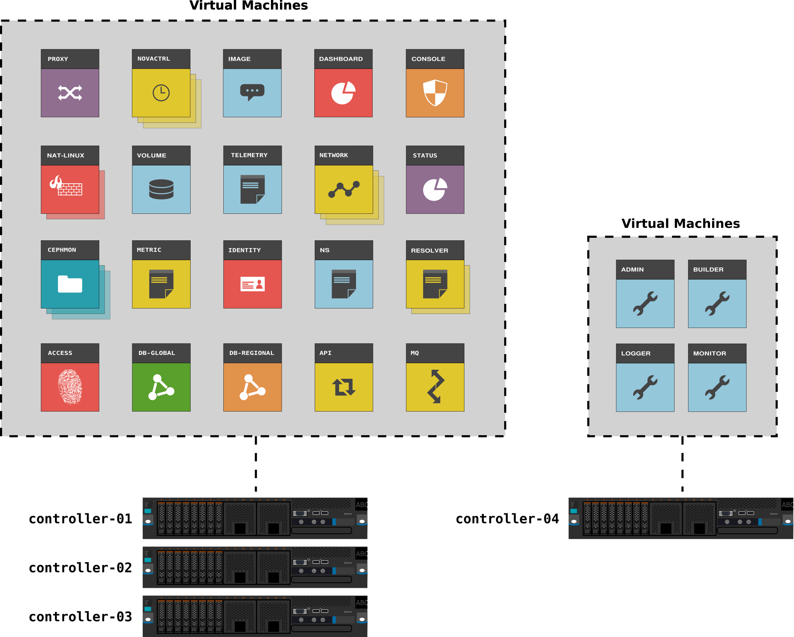

=============
Node overview
=============

**node = a virtual machine running on a physical controller box with libvirt**

This overview shows the different nodes, which network the nodes have access to
and where the Openstack and other services are running.

.. image:: images/nodes.png
   :target: ../_images/nodes.png

.. WARNING::
   The following is under construction!

New stuff:

Physical hardware
-----------------

The following illustration show the physical hardware, in broad
terms. The number of compute hosts and storage hosts is horizontally
scalable and will vary from region to region.

.. image:: images/physical-hardware.png

The illustration shows these types of physical components:

**Management switch**
  Network ethernet switch used for internal networking,
  i.e. non-routed RFC1918 addresses. These are only used for
  management tasks.

**Public switch**
  A switch that has access to Internet. These switches also perform
  layer 3 routing, and are used to provide access to the public
  services in UH-IaaS.

**Controller hosts**
  Servers that are running virtual machines manually with libvirt
  (i.e. not managed by OpenStack). All OpenStack components such as
  the dashboard, API services etc. are running as virtual machines on
  these hosts.

**Compute hosts**
  Servers that are used as compute hosts in OpenStack. Customer's
  virtual machines are running on these servers.

**Storage hosts**
  Servers that are part of the Ceph storage cluster. They provide
  storage services to OpenStack (e.g. storage volumes).

Virtual machines
----------------

The illustration below shows the various virtual machines running on
the controller hosts.

Some of the virtual machines have a purely administrative purpose,
some provide internal infrastructure services, and some are running
OpenStack components.

Some virtual machines are scaled out horizontally, typically one on
each controller host, mostly this applies on OpenStack services. This
is done for efficiency and redundancy reasons.

Virtual machines running OpenStack components
~~~~~~~~~~~~~~~~~~~~~~~~~~~~~~~~~~~~~~~~~~~~~

These VMs are purely running OpenStack components.

**image-01**
  Runs the OpenStack Image component, Glance.

**dashboard-01**
  Runs the OpenStack Dashboard component, Horizon.

**novactrl-0{1,2,3}**
  Three VMs in a redundant setup, runs the controller part (e.g. API)
  of the OpenStack Compute component, Nova.

**volume-01**
  Runs the OpenStack Volume component, Cinder.

**telemetry-01**
  Runs the OpenStack metering component, Ceilometer.

**network-0{1,2,3}**
  Three VMs in a redundant setup, runs the OpenStack Network
  component, Neutron.

Virtual machines running infrastructure services
~~~~~~~~~~~~~~~~~~~~~~~~~~~~~~~~~~~~~~~~~~~~~~~~

These VMs are running various infrastructure services, that are used
by either the OpenStack components, or other infrastructure or
administrative services, or both.

**proxy-01**
  Proxy service for Internet access for the infrastructure nodes that
  are not on any public network.

**ns-01**
  Autoritative DNS server.Available publicly as
  ns.<location>.uh-iaas.no.

**resolver-0{1,2}**
  Resolving (caching) DNS servers. These servers are running in a
  redundant setup via the Anycast protocol. Available publicly as
  resolver.<location>.uh-iaas.no.

**api-01**
  Runs HAProxy for all API services. Available publicly as
  api.uh-iaas.no.

**db-global-01**
  MariaDB (MySQL) database that is cross-regional. This database is
  synced to the other region.

**db-regional-01**
  MariaDB (MySQL) database that is regional. Contains only data that
  is localized to this region.

**console-01**
  Provides console services for instances in OpenStack, available via
  the dashboard.

**mq-01**
  Runs a message queue (RabbitMQ) that OpenStack uses for internal
  communication and messaging.

**access-01**
  Provides authentication services via Dataporten.

**metric-01**
  Collects data points for measuring performance counters and other
  things.

**status-01**
  Provides a graphical view of performance counters and other metric
  data. Available publicly as https://status.uh-iaas.no/

**nat-linux-0{1,2}**
  Two nodes that functions as a NAT-ing proxy for instances, in order
  to give instances with a IPv6 only network access to the outside
  world via their internal IPv4 address.

**cephmon-0{1,2,3}**
  Runs the cephmon service for the Ceph storage cluster.

Virtual machines running administrative services
~~~~~~~~~~~~~~~~~~~~~~~~~~~~~~~~~~~~~~~~~~~~~~~~

These VMs are running on a separate controller host, because they need
to be up and running during maintenance on other VMs.

**admin-01**
  Runs Foreman for e.g. provisioning tasks, and functions at
  Puppetmaster for all hosts.

**monitor-01**
  Runs Sensu for monitoring tasks.

**logger-01**
  Log receiver for all hosts.

**builder-01**
  Runs our builder service, for building OpenStack images.
