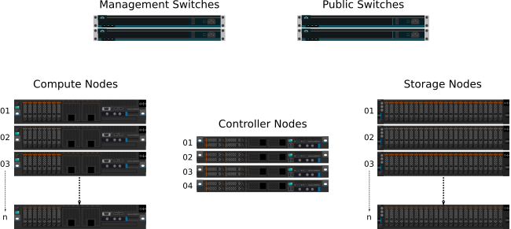
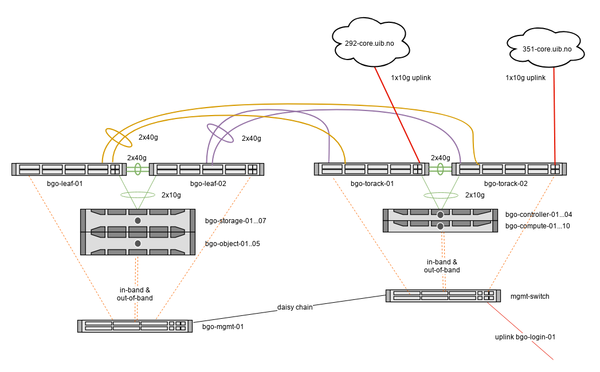
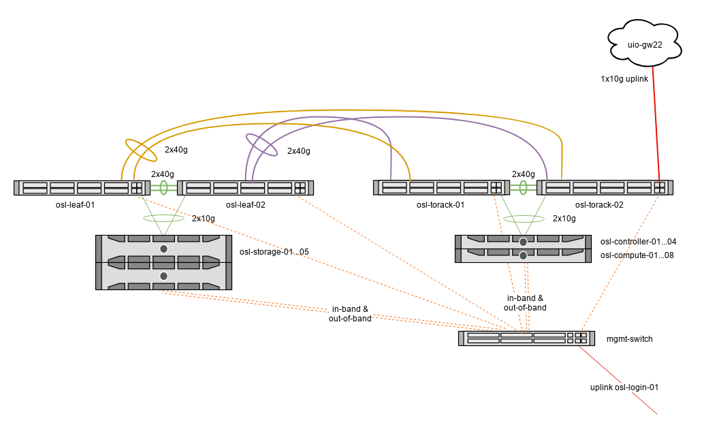

=================
Physical hardware
=================

The following illustration show the physical hardware, in broad
terms. The number of compute hosts and storage hosts is horizontally
scalable and will vary from region to region.

The illustration shows these types of physical components:

**Management switch**
  Network ethernet switch used for internal networking,
  i.e. non-routed RFC1918 addresses. These are only used for
  management tasks.

**Public switch**
  A switch that has access to Internet. These switches also perform
  layer 3 routing, and are used to provide access to the public
  services in UH-IaaS.

**Controller hosts**
  Servers that are running virtual machines manually with libvirt
  (i.e. not managed by OpenStack). All OpenStack components such as
  the dashboard, API services etc. are running as virtual machines on
  these hosts.

**Compute hosts**
  Servers that are used as compute hosts in OpenStack. Customer's
  virtual machines are running on these servers.

**Storage hosts**
  Servers that are part of the Ceph storage cluster. They provide
  storage services to OpenStack (e.g. storage volumes).

===================
Networking overview
===================

Physical networking connections of each site:

**BGO**

**OSL**

