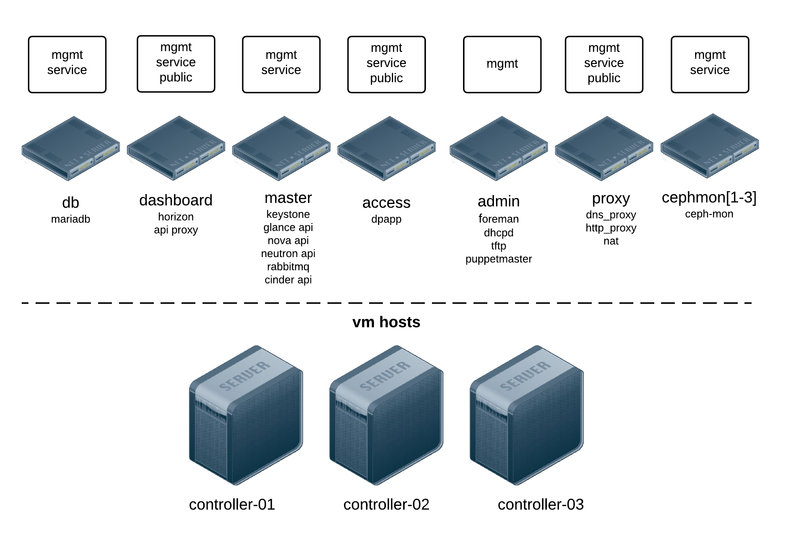

=============
Node overview
=============

**node = a virtual machine running on a physical controller box with libvirt**

This overview shows the different nodes, which network the nodes have access to
and where the Openstack and other services are running.

