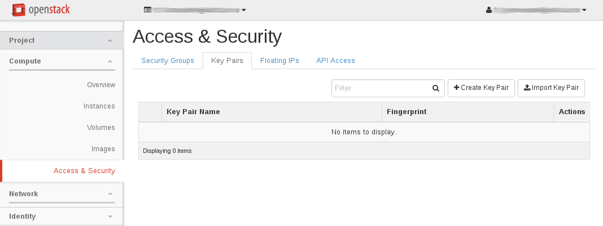
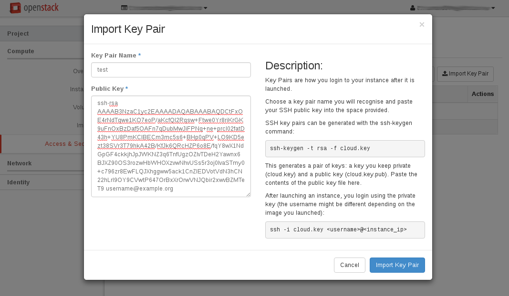
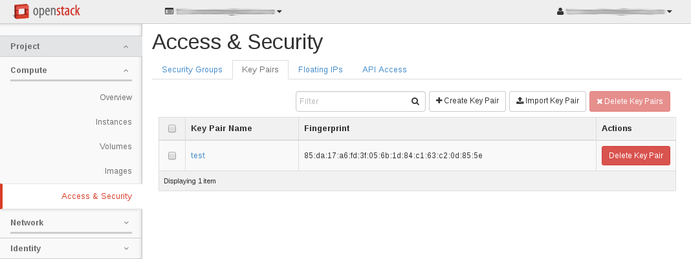
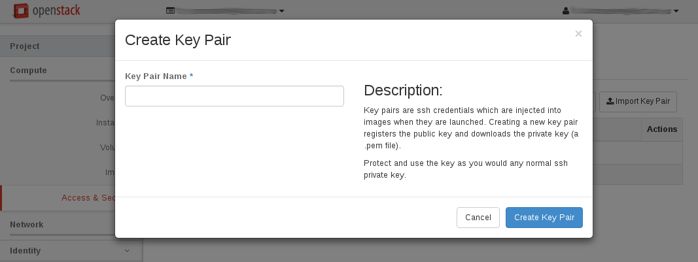
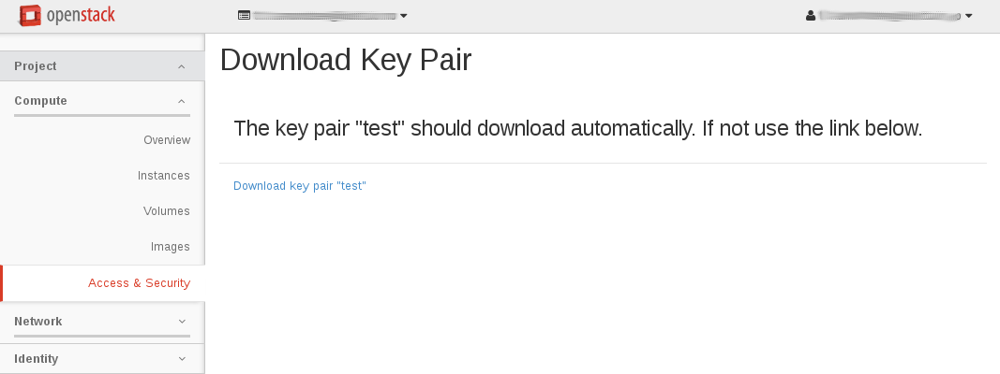
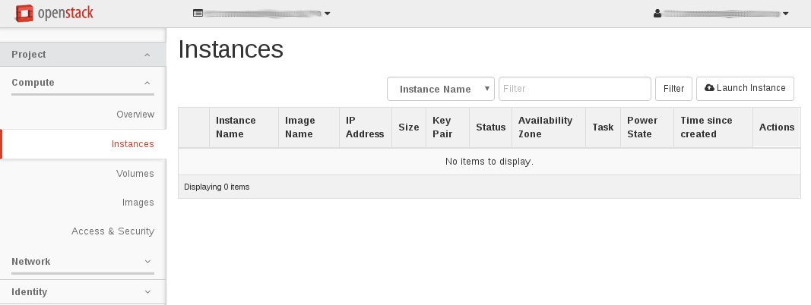
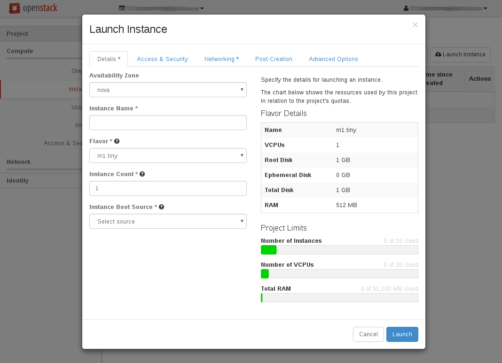

.. |date| date::

Create a Linux virtual machine
==============================

Last changed: |date|

.. contents::

Setting up a keypair
--------------------

Virtual machines in UH-IaaS are accessed using SSH keypairs. There are
numerous ways to achieve this, depending on the OS on your local
computer.

Importing an existing key
~~~~~~~~~~~~~~~~~~~~~~~~~

If the local computer is Linux, any BSD variant such as
FreeBSD, or MacOSX, the easiest way is to create a keypair locally if
you don't already have one::

  $ ssh-keygen 
  Generating public/private rsa key pair.
  Enter file in which to save the key (/home/username/.ssh/id_rsa): 
  Enter passphrase (empty for no passphrase): 
  Enter same passphrase again: 
  Your identification has been saved in /home/username/.ssh/id_rsa.
  Your public key has been saved in /home/username/.ssh/id_rsa.pub.
  The key fingerprint is:
  SHA256:UrFhPtth14+S9f8BzMHsy+KbAZJMoC1s+8nHh9UDIc4 username@example.org
  The key's randomart image is:
  +---[RSA 2048]----+
  |     . .+.       |
  |  . o +o.+. o.   |
  |   = . E=.o .+o  |
  |  . o o..=oo+o.+ |
  |   .  .+So.oo=. o|
  |    o o.+ . o.o .|
  |     + + . o o ..|
  |      . . . +   o|
  |           +.   .|
  +----[SHA256]-----+

Another option is to let OpenStack create a keypair for you, more
about that later. To import your existing keypair into OpenStack, go
to the **Access & Security** tab under **Project**:

Click the button labeled "Import Key Pair". Give the keypair a name,
and enter the contents of the **id_rsa.pub** file in the "Public Key"
field:

Click "Import Key Pair" and the key is saved:

Letting OpenStack create a keypair
~~~~~~~~~~~~~~~~~~~~~~~~~~~~~~~~~~

You can let OpenStack create a keypair for you, if you don't wish to
use an existing one. Go to the **Access & Security** tab
under **Project**:

Click on "Create Key Pair":

Choose a name for you keypair and click "Create Key Pair". The newly
created private key will be downloaded by the browser automatically:

The name of the downloaded file is based on the name you provided
earlier. In this example the file is called "test.pem" as "test" was
provided as the keypair name.

In order to use the downloaded private key, use the **-i** option to
ssh, like this (example for "test.pem" above)::

  $ ssh -i test.pem <virtual-machine>

Replace "<virtual-machine>" with the name or IP of the virtual machine
that this keypair is assigned to.

Create a virtual machine
------------------------

Once you have an SSH keypair defined, you can proceed with creating a
virtual machine (instance). In the **Project** tab,
select **Instances**:

Click "Launch Instance". The following window will appear:

In this window, enter the following values:

* Availability Zone: nova (the default)
* Instance Name: Select a name for your new virtual machine
* Flavor: Choose whichever size that fits your purpose
* Instance Count: How many virtual machines to create (usually only 1)
* Instance Boot Source: Select whichever is appropriate for your
  needs:
  - Boot from image: This is usually preferred. In this case, the
    virtual machine will boot from a standard cloud image.
  - Boot from snapshot: If you have previously taken a snapshot from
    another virtual machine, you can boot from it when creating your
    new virtual machine
  - Boot from volume: FIXME.
  - Boot from image (creates a new volume): FIXME
  - Boot from volume snapshot (creates a new volume): FIXME

