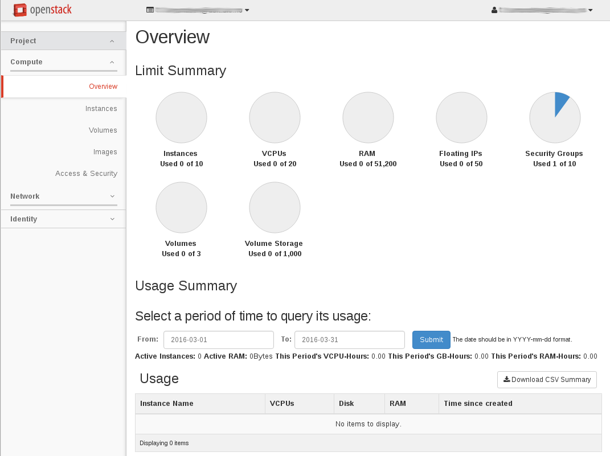
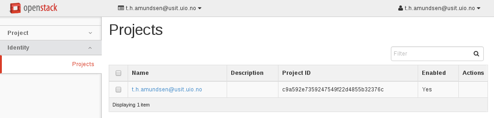

.. |date| date::

The dashboard
=============

Last changed: |date|

.. contents::

The dashboard is the common web user interface for OpenStack. It is a
simple web GUI where you can perform regular tasks, including
provision instances, set up access control, provision volumes etc.

Project tab
-----------

Projects are organizational units in the cloud, and are also known as
tenants or accounts. Each user is a member of one or more
projects. Within a project, a user creates and manages instances.

From the Project tab, you can view and manage the resources in a
selected project, including instances and images. You can select the
project from the drop down menu at the top left.

From the Project tab, you can access the following categories:

Compute tab
~~~~~~~~~~~

* **Overview**: View reports for the project.

* **Instances**: View, launch, create a snapshot from, stop, pause, or
  reboot instances, or connect to them through VNC.

* **Volumes**: Use the following tabs to complete these tasks:

  - *Volumes*: View, create, edit, and delete volumes.
  - *Volume Snapshots*: View, create, edit, and delete volume snapshots.

* **Images**: View images and instance snapshots created by project
  users, plus any images that are publicly available. Create, edit,
  and delete images, and launch instances from images and snapshots.

* **Access & Security**: Use the following tabs to complete these tasks:

  - *Security Groups*: View, create, edit, and delete security groups
    and security group rules.
  - *Key Pairs*: View, create, edit, import, and delete key pairs.
  - *Floating IPs*: Allocate an IP address to or release it from a
    project.
  - *API Access*: View API endpoints.

.. NOTE::
   Even though the *Floating IPs* tab is present under "Access &
   Security", this feature is not used in the UH-IaaS cloud.

Network tab
~~~~~~~~~~~

* **Network Topology**: View the network topology.
* **Networks**: Create and manage public and private networks.
* **Routers**: Create and manage routers.

.. NOTE::
   The *Networks* and *Routers* tabs are present, but their
   functionality is not used in the UH-IaaS cloud.

Identity tab
------------

As a regular user, you can view any project that you're a member of.

