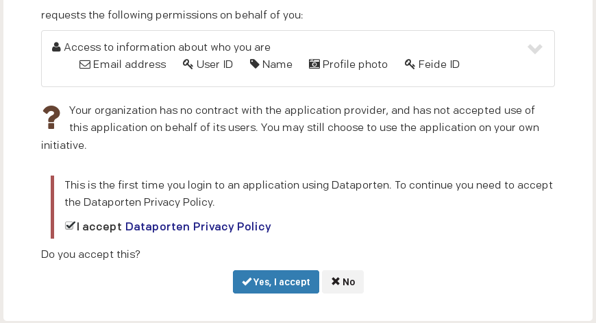

.. |date| date::

Logging in
==========

Last changed: |date|

.. contents::

Which dashboard?
----------------

Currently the UH-IaaS is deployed in two locations, UiB and UiO. To
log in to the UiB dashboard, point your browser to:

  https://dashboard.iaas.uib.no/

If you want to use the UiO dashboard, point your browser to:

  https://dashboard.iaas.uio.no/

Which one is right for you? It depends on which cloud deployment you
wish to use. If you're a UiO user, you may want to use the
infrastructure at UiO. Similarly, as a UiB user, you'll probably want
to use the UiB version. Currently, the two implementations are
identical.

Step by step
------------

.. _Dataporten: https://www.uninett.no/en/service-platform-dataporten
.. _UNINETT: https://www.uninett.no/en

Regardless of which of the locations' dashboard you connect to, you'll
be presented with the following:

.. image:: images/dashboard-login-01.png
   :align: center
   :alt: The default login screen

There are two methods for logging in. The method labelled "Dataporten"
is correct for regular users. The "Local user" method is reserved for
administrator and testing purposes. Dataporten_ is an external
authentication service provided by UNINETT_. To log in, choose
"Dataporten" as authentication mechanism, then click "Connect". You'll
be redirected to this page:

.. image:: images/dashboard-login-02.png
   :align: center
   :alt: Dataporten: choose institution

Select the correct educational institution, by clicking on it.

If this is your first time using the UNINETT Dataporten service, you
will be asked to accept the privacy policy. This step needs to be
completed before you can continue:

.. NOTE::
   If you at this point get an "Internal Server Error", reload the
   dashboard URL from `which dashboard?`_ and try again. It should
   work the second time. This is a bug.

You'll then reach this page:

.. image:: images/dashboard-login-03.png
   :align: center
   :alt: Dataporten: login

Type in your regular user name and password, and click "Login". You
should then be redirected back to the UH-IaaS dashboard:

.. image:: images/dashboard-login-99.png
   :align: center
   :alt: Log in finished

You are now logged in, and can proceed with using OpenStack.

.. IMPORTANT::
   When logging in for the first time, you need to accept that
   Dataporten_ collects and stores some information about you.
