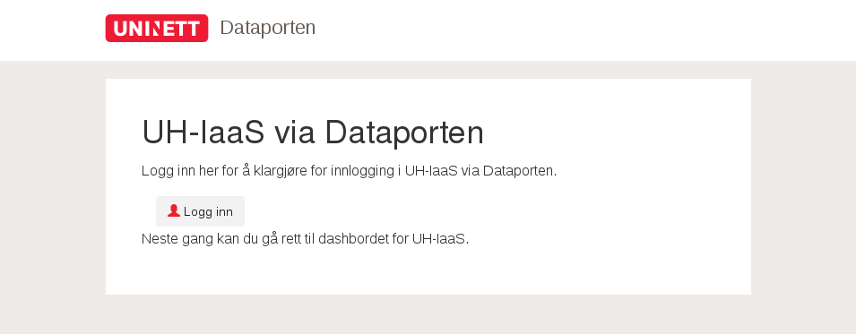
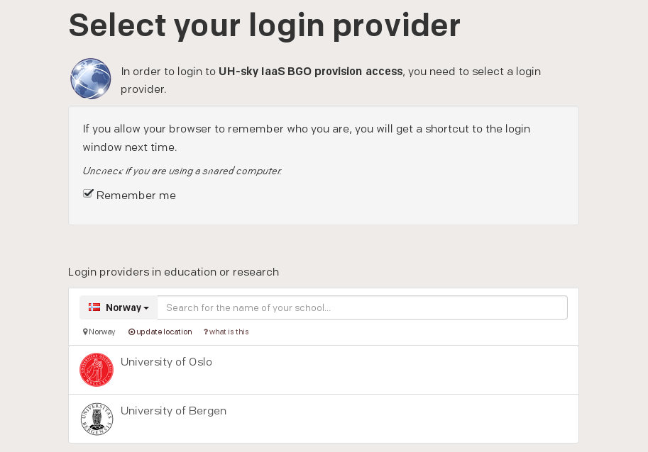
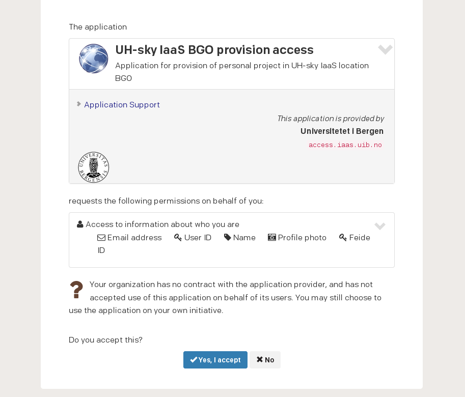
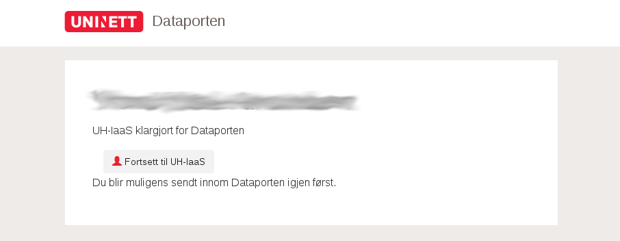
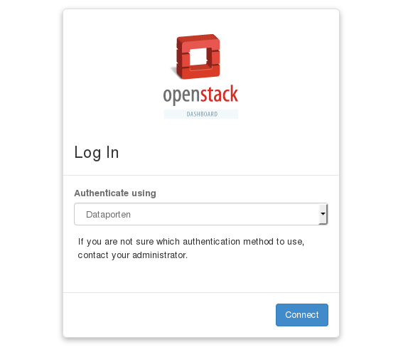
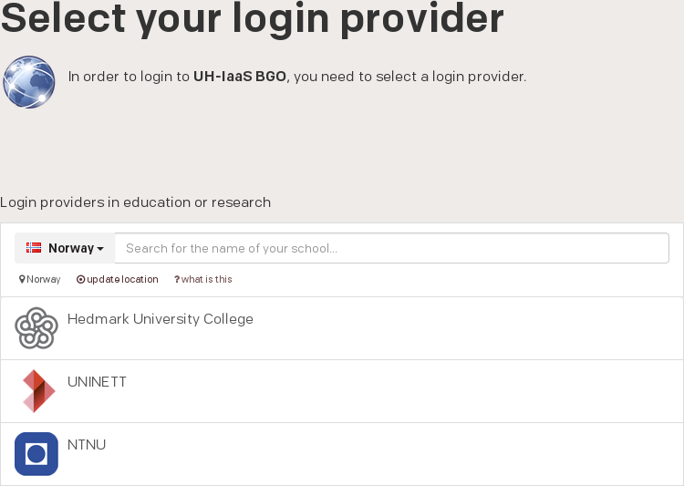
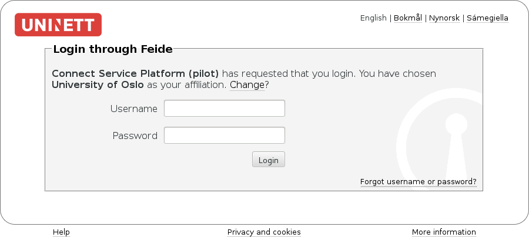
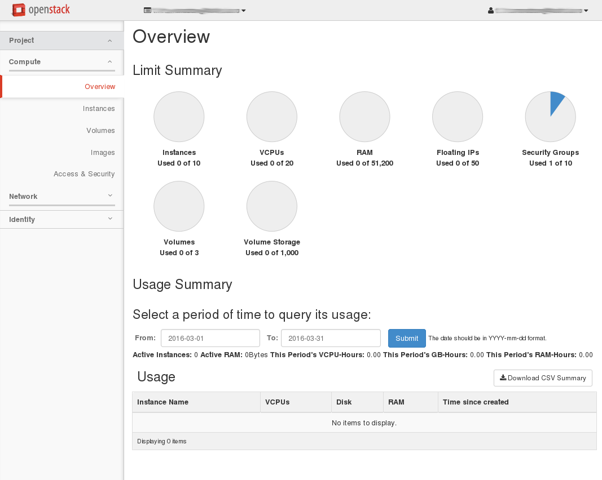

.. |date| date::

Logging in
==========

Last changed: |date|

.. contents::

.. _Dataporten: https://www.uninett.no/en/service-platform-dataporten
.. _UNINETT: https://www.uninett.no/en

First time login
----------------

.. NOTE::
   This step is only needed if you've never logged in before. For
   the normal login procedure, skip this step and go directly to
   `Subsequent logins`_.

In order to successfully log in at the dashboard at either location,
you first need to provision yourself as a user with an appropriate
group and project. This is accomplished by following the steps below.

First, decide where (i.e. which location) you want to provision. For
BGO, go to

  https://access.iaas.uib.no/

or for OSL:

  https://access.iaas.uio.no/

The following window will appear:

Click ``Logg inn``:

Here, you need to select your login provider. You should find your
university or college in the list. Simply select it and the following
appears:

In order to use this service, and to authenticate using `Dataporten`_,
you need to accept that the service stores some information about
you. Click ``Yes, I accept`` to continue.

This finishes the initial login and provision procedure. In order to
continue to the dashboard, click ``Fortsett til UH-IaaS``.

Subsequent logins
-----------------

Currently the UH-IaaS is deployed in two locations, UiB and UiO. To
log in to the UiB dashboard, point your browser to:

  https://dashboard.iaas.uib.no/

If you want to use the UiO dashboard, point your browser to:

  https://dashboard.iaas.uio.no/

Which one is right for you? It depends on which cloud deployment you
wish to use. If you're a UiO user, you may want to use the
infrastructure at UiO. Similarly, as a UiB user, you'll probably want
to use the UiB version. Currently, the two implementations are
identical.

Regardless of which of the locations' dashboard you connect to, you'll
be presented with the following:

There are two methods for logging in. The method labelled "Dataporten"
is correct for regular users. The "Local user" method is reserved for
administrator and testing purposes. Dataporten_ is an external
authentication service provided by UNINETT_. To log in, choose
"Dataporten" as authentication mechanism, then click "Connect". You'll
be redirected to this page:

Select the correct educational institution, by clicking on it. You'll
then reach this page:

Type in your regular user name and password, and click "Login". You
should then be redirected back to the UH-IaaS dashboard:

You are now logged in, and can proceed with using OpenStack.
