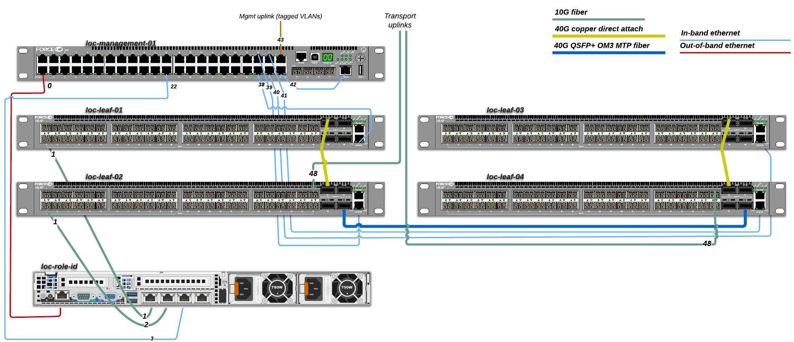
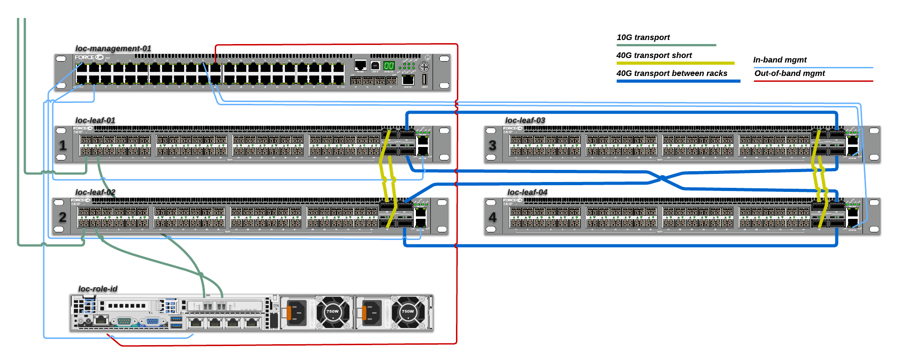

Cabling
=======

All of the servers will be connected with 2x10G fiber links, a single 1G
ethernet cable for eth0 (PXE) and a 1G ethernet for the bare metal controller
(BMC).

The routers will be cabled as simple as possible for the mvp, then we'll
increase the number of physical connections at a later stage when testing
solutins for host redundancy.

Connection sheet
----------------

A `LibreOffice spreadsheet`_ documents all the connections between the hosts and
devices. It is also available in `HTML format`_.

.. _LibreOffice spreadsheet: ../_static/cabling.ods
.. _HTML format: ../_static/cabling.htm

Conceptual overview
-------------------

This illustrates the cabling concept without including all the connected hosts.

This image is the same as the one above except the routers are fully connected
to enable testing of more redundancy scenarios.

