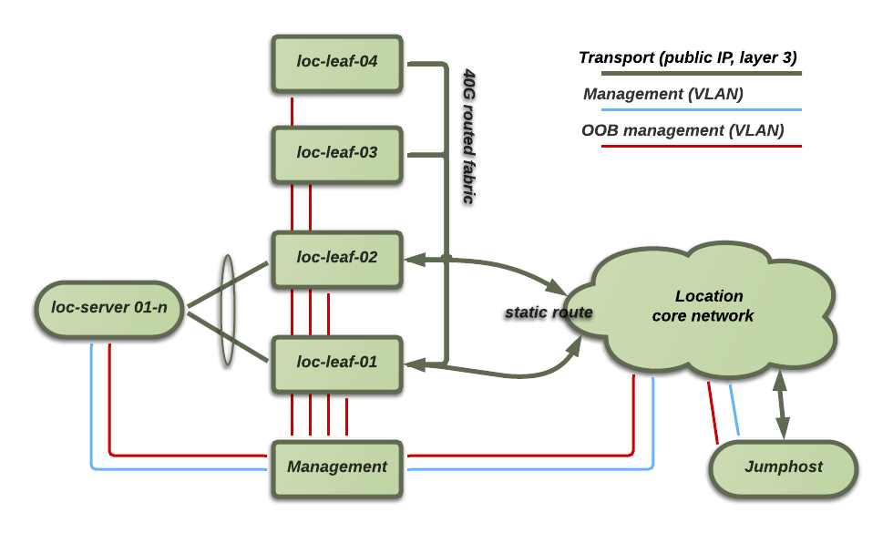

Host network logical concept
============================

This shows an overview of the different logical networks planned.

Service endpoint traffic is statically routed from the location core to the
IaaS transport network. The transport network itself is internally an OSPF
routed fabric, designed first as a fully-connected mesh of routers. Later, if
we expand, a spine layer of routers will be added.

Management functions are provided by two separate management networks
implemented as VLANs. The VLANs are tagged through the managment switch into
the core network, with their IP gateways terminated on the core or directly on
a jumphost.

