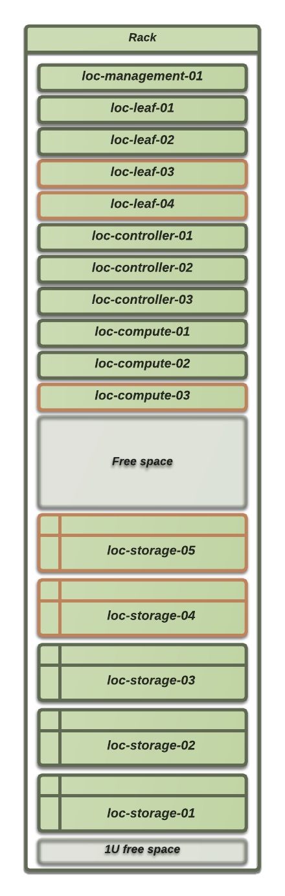
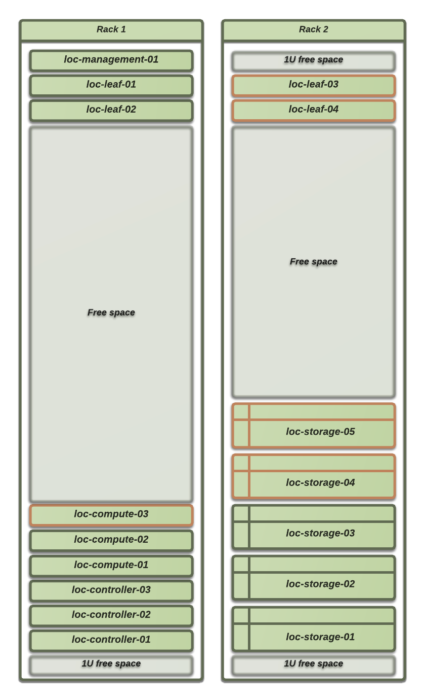

Placement of equipment in racks
===============================

We got two possible scenarios, one with a single rack available at the
location, the other one with two. The physical boxes outlined in red are
connected to routers loc-leaf-03 and 04. In a two rack setup there will be a
number of cables crossing the racks because of our test requirements.

In a future expanded setup all cabling will be internal to each rack except the
spine router links and stacking of management switches.

Single rack placement guide
---------------------------

Two rack placement guide
------------------------

