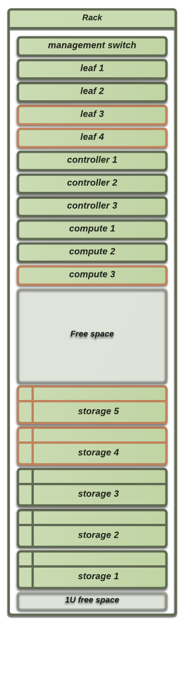

============================
2014-11-13: Planning meeting
============================
.. contents:: :depth: 2

Present: Jan Ivar, Tor, Trond, Mikael, Hans-Henry, Erlend

1. Further definition of MVP
============================

Hardware placement in racks, networks, jump hosts. We need to discuss
these in more detail.

Outcome
-------

Jan Ivar has described (in a drawing) how to populate the rack at each
site with the Dell hardware:

The routers and management switches have reversed air flow for our convenience.
This will make cabling work easier.

We discussed in-band vs out-of-band management for the routers (compared to
servers, that is). The management ports on the routers will be treated as in-band.

The first revision of the IaaS will be set up in the most simple manner in regard
to physical failover for the infrastructure hosts, but will be fully cabled up
to provide for future improvement.

Actions
-------

- Jan Ivar creates a detailed cabling chart for all the equipment. The equipment
is to be identically set up at each site

2. Puppet versus hostnames, certificates, global identifiers across sites
=========================================================================

Discussion around DNS, public vs internal IP addresses, name standards, auto
signing of puppet certificates. This meeting was not ready to make any decisions.

Actions
-------

- The next meeting will feature some written material on the topics to better
facilitate a good debate, and better preparations.

3. Project codebase versus winch?
=================================

Winch will continue to be a side project for testing, training and code development.
We need to start working on a new production codebase. It's' not clear for now
who can start contributing and when.

Actions
-------

- Jan Ivar will create a skeleton for a new production codebase

- We will have a kickoff day for the new production codebase

- We'll start iterating together on the codebase and growing it based on feature requests

4. Placement of shared OS images for cloud, testing
===================================================

We need a web server where we kan place images produced by the project.

Actions
-------

- Short term solution for now - we all have arbitrary web servers we can use

- We will create a fork of the bento project and integrate our own code
