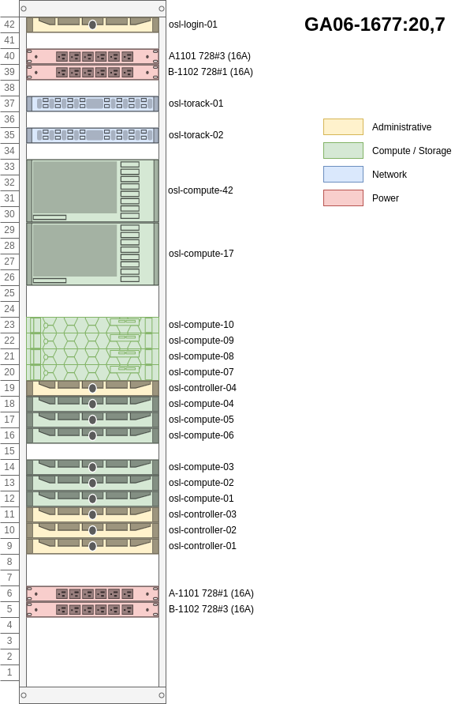

==========================
Rack and power consumption
==========================

Rack placement and power consumption planning.

Region OSL
----------

Rack 1
~~~~~~

Estimated power consumption:

================= ========= =========
 Host              Typical   Maximum
================= ========= =========
osl-login-01      ?         ?
osl-torack-01     ?         ?
osl-torack-02     ?         ?
osl-compute-01    ?         ?
osl-compute-02    ?         ?
osl-compute-03    ?         ?
osl-compute-04    ?         ?
osl-compute-05    ?         ?
osl-compute-06    ?         ?
osl-compute-07    ?         ?
osl-compute-08    ?         ?
osl-compute-09    ?         ?
osl-compute-10    ?         ?
osl-compute-17    ?         ?
osl-compute-42    ?         ?
osl-controller-01 ?         ?
osl-controller-02 ?         ?
osl-controller-03 ?         ?
osl-controller-04 ?         ?
================= ========= =========
Total             ?         ?
================= ========= =========

