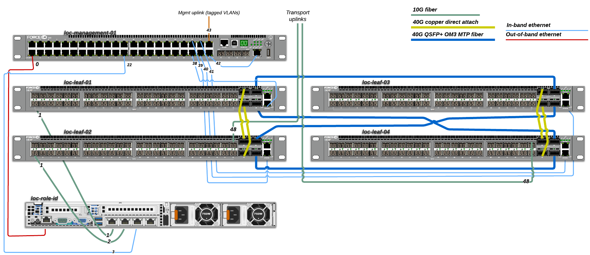

Cabling
=======

All of the servers will be connected with dual 10G fiber links, a single 1G
ethernet cable for management (PXE) and a 1G ethernet for the bare metal
controller (BMC).

The layer 3 switches will be cabled as simple as possible for the first minimal product
installation. Later we'll increase the number of physical connections for testing more
designs and solutions.

Connection sheet
----------------

A `LibreOffice spreadsheet`_ documents all the connections between the hosts and
devices. It is also available in `HTML format`_.

.. _LibreOffice spreadsheet: ../_static/cabling.ods
.. _HTML format: ../_static/cabling.htm

Conceptual overview
-------------------

This illustrates the cabling concept with a minmal solution for switch
connectivity.

.. image:: images/cabling_overview_mvp.png
   :target: ../_images/cabling_overview_mvp.png

This is the same concept as above, but with additional switch cabling to to
enable testing of different network design and redundancy scenarios.

