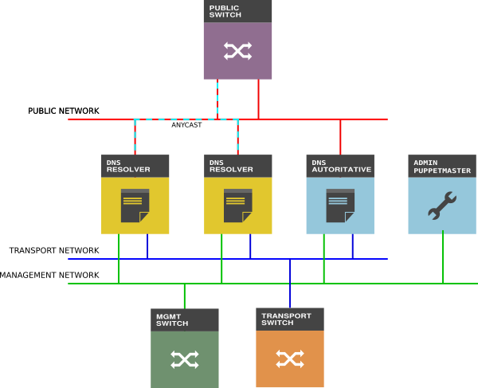

===
DNS
===

We use the domains `uh-iaas.no` and `uhdc.no`.

Architecture
============

Public zone: uh-iaas.no
=======================

.. _hieradata/osl/common.yaml: https://github.com/norcams/himlar/blob/master/hieradata/osl/common.yaml
.. _hieradata/bgo/common.yaml: https://github.com/norcams/himlar/blob/master/hieradata/bgo/common.yaml
.. _hieradata/common/common.yaml: https://github.com/norcams/himlar/blob/master/hieradata/common/common.yaml

This zone is delegated to:

* ns1.uh-iaas.no (master - located in OSL)
* ns2.uh-iaas.no (slave - located in BGO)

Editing this zone is done via Puppet hieradata. Since the OSL NS-host
(ns1.uh-iaas.no) is master for this zone, editing this zone should be
done in `hieradata/osl/common.yaml`_.

In this zone we have the following records:

============================= ====== ===========================================
Record                        TYPE   VALUE
============================= ====== ===========================================
access.uh-iaas.no             A      158.39.77.250
access-bgo.uh-iaas.no         A      158.39.77.250
access-osl.uh-iaas.no         A      158.37.63.250
api.uh-iaas.no                A      158.39.77.250
dashboard.uh-iaas.no          A      158.39.77.254
dashboard-bgo.uh-iaas.no      A      158.39.77.254
dashboard-osl.uh-iaas.no      A      158.37.63.254
ns1.uh-iaas.no                A      158.37.63.251
ns2.uh-iaas.no                A      158.39.77.251
report.uh-iaas.no             A      158.39.77.250
report-bgo.uh-iaas.no         A      158.39.77.250
report-osl.uh-iaas.no         A      158.37.63.250
request.uh-iaas.no            A      158.39.77.250
status.uh-iaas.no             A      158.39.77.250
status-bgo.uh-iaas.no         A      158.39.77.250
status-osl.uh-iaas.no         A      158.37.63.250
ns1.uh-iaas.no                AAAA   2001:700:2:82ff::251
ns2.uh-iaas.no                AAAA   2001:700:2:83ff::251
docs.uh-iaas.no               CNAME  uh-iaas.readthedocs.io
www.uh-iaas.no                CNAME  norcams.github.io
uh-iaas.no                    MX     10 uninett-no.mx1.staysecuregroup.com
uh-iaas.no                    MX     20 uninett-no.mx2.staysecuregroup.net
============================= ====== ===========================================

Internally delegated zone: osl.uh-iaas.no
-----------------------------------------

This zone is delegated to:

* ns1.uh-iaas.no (master - located in OSL)
* ns2.uh-iaas.no (slave - located in BGO)

Editing this zone is done via Puppet hieradata. Since the OSL NS-host
(ns1.uh-iaas.no) is master for this zone, editing this zone should be
done in `hieradata/osl/common.yaml`_.

In this zone we have the following records:

============================= ====== ===========================================
Record                        TYPE   VALUE
============================= ====== ===========================================
compute.api.osl.uh-iaas.no    A      158.37.63.250
identity.api.osl.uh-iaas.no   A      158.37.63.250
image.api.osl.uh-iaas.no      A      158.37.63.250
metric.api.osl.uh-iaas.no     A      158.37.63.250
network.api.osl.uh-iaas.no    A      158.37.63.250
placement.api.osl.uh-iaas.no  A      158.37.63.250
volume.api.osl.uh-iaas.no     A      158.37.63.250
console.osl.uh-iaas.no        A      158.37.63.250
resolver.osl.uh-iaas.no       A      158.37.63.252
resolver.osl.uh-iaas.no       AAAA   2001:700:2:82ff::252
============================= ====== ===========================================

Internally delegated zone: bgo.uh-iaas.no
-----------------------------------------

This zone is delegated to:

* ns1.uh-iaas.no (slave - located in OSL)
* ns2.uh-iaas.no (master - located in BGO)

Editing this zone is done via Puppet hieradata. Since the BGO NS-host
(ns2.uh-iaas.no) is master for this zone, editing this zone should be
done in `hieradata/bgo/common.yaml`_.

In this zone we have the following records:

============================= ====== ===========================================
Record                        TYPE   VALUE
============================= ====== ===========================================
compute.api.bgo.uh-iaas.no    A      158.39.77.250
identity.api.bgo.uh-iaas.no   A      158.39.77.250
image.api.bgo.uh-iaas.no      A      158.39.77.250
metric.api.bgo.uh-iaas.no     A      158.39.77.250
network.api.bgo.uh-iaas.no    A      158.39.77.250
placement.api.bgo.uh-iaas.no  A      158.39.77.250
volume.api.bgo.uh-iaas.no     A      158.39.77.250
console.bgo.uh-iaas.no        A      158.39.77.250
resolver.bgo.uh-iaas.no       A      158.39.77.252
resolver.bgo.uh-iaas.no       AAAA   2001:700:2:83ff::252
============================= ====== ===========================================

Internal zone: uhdc.no
======================

The following zones in **uhdc.no** has been delegated to us:

================= ========================
Zone              NS
================= ========================
bgo.uhdc.no       ns1.uh-iaas.no (slave)
                  ns2.uh-iaas.no (master)
osl.uhdc.no       ns1.uh-iaas.no (master)
                  ns2.uh-iaas.no (slave)
test01.uhdc.no    alf.uib.no
                  begonia.uib.no
test02.uhdc.no    ns1.uio.no
                  ns2.uio.no
================= ========================

Editing these zones is done via Puppet hieradata. Most of the records
should be present in `hieradata/common/common.yaml`_.

Test domains
============

For public domain in test we have a delegated subdomains:

========= ===================
Region    Domain
========= ===================
test01    test.iaas.uib.no
test02    test.iaas.uio.no
========= ===================
