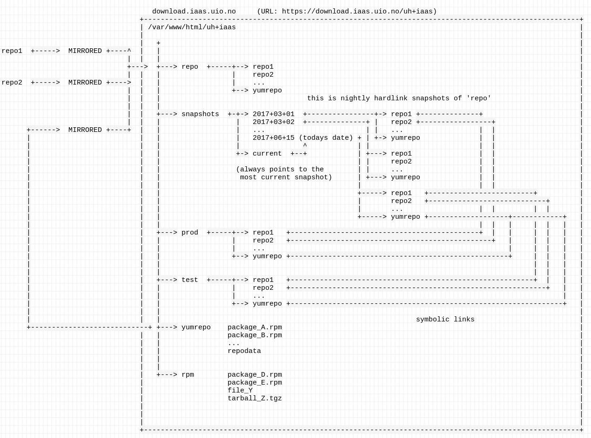

=================
Repository server
=================


Introduction
============


For local caching of external repositories and to facilitate a repository of
packages created by the UH-IaaS team etc., a server system is installed.
Because the production environment has to be carefully managed, some issues are
raised which is attempted resolved by this setup:

* Production servers must only run well-known versions and combinations of
  software (which is supposed to be tested and approved before deployment)
* Possible to check state of code at any date in the past for debugging
* Possible to test new code without disturbing production environment
* Ability to maintain our software in the same manner as any external
  RPM repository
* Means to distribute all kind of data files without versioning


To accomplish all of this we have implemented both a system for versioned/snapshotted
mirrors of any 'external' repo (whatever the location), a local ordinary RPM
repository and a general distribution point.

* **Hostname**: ``iaas-repo.uio.no``
* **Alias** (used in code): ``download.iaas.uio.no``
* **Access**: as for normal infrastructure nodes (*iaas*-user from one of the
  login nodes)
* **Repo root directory**: ``/var/www/html/uh-iaas``
* **Available protocols**: ``https``


.. Note::
   The implementor accepts the fact that the naming scheme
   for these directories is misleading! Please read the description
   before assuming anything related to the role of the directory!


Executive Summary
-----------------

**repo** is a locally hosted mirror of a set of external repositories. A
snapshot is taken of each repo every night, these snapshots resides inside the
**snapshot** directory date-stamped. For every one of these repositories (at
least the ones which are utilized by the UH-IaaS infrastructure), there is a
pointer to one of those snspshots beneath the **test** respective **prod**
directories. Those pointers are never moved without consideration or testing,
and especially the links in the **prod** directory. The upshot is thus: packages
and files can be trusted not to be updated or altered in an uncontrolled
fashion, and is available locally at all times.

**yumrepo** and **aptrepo** should be assumed to be like any other ``external``
repositories, only these `external` repositories are coincidentally managed by
the UH-IaaS team. Data configured into these are then available for consumption
in the same controlled manner as any other external repository which is mirrored
locally.

**rpm** and **ports** are `free and unmanaged` repositories without the
forementioned snapshotting and consistent control. Data located here is
available instantly, but outside of any version control and without any kind of
meta data.


Diagram of setup
----------------





Directory description
---------------------

* **repo**: Mirror hierarchy. This is where all defined repositories are mirrored
  to. Content is normally mirrored nightly.
* **snapshots**: Nightly snapshot of all mirrors under ``repo``. Each snapshot is
  named by the date and time of creation.
* **prod**: For each repository a pointer (symbolic link) to a snapshot of the
  same.
* **test**: As for ``prod``, but separate link.
* **yumrepo**: Locally maintained RPM repository. Mirrored under ``repo`` as any
  external repository is (named *uh-iaas*).
* **aptrepo**: Locally maintained APT repository. Mirrored under ``repo`` as any
  external repository is (named *uh-iaas-apt*).
* **rpm**: Generic file distribution. No metadata, versioning, mirroring or
  snapshotting.
* **ports**: For FreeBSD packages. No metadata, versioning, mirroring or
  snapshotting.  

Common attributes and requirements
==================================

Packages built locally by the project are made available for use (default for the world!)
by storing it in one of the prepared directories depending on whether the package is to
be part of a yum repository or as a stand-alone package or file.

The *iaas* group owns all files and directories under the repository root
directory; the hierarchy is configured with the `set group ID` bit. Accordingly,
all relevant repo operations can (and should) be done as the *iaas* user.

**NOTE**

Make sure new packages and files have the correct SELinux label::

  sudo restorecon <file>

or::

  sudo restorecon -R <directory>


Detailed descriptions
=====================


YUM repository
--------------

**Directory name**: ``yumrepo``

Packages which should be maintained by ordinary package maintained procedures,
are located in the YUM repository located in ``yumrepo``. These files/packages
are then considered and consumed exactly like any other, external, repository used by the
project/code.


**IMPORTANT**

After all file operations update the repository meta data::

  /usr/bin/createrepo <repo root directory>/yumrepo


**URL**: `<https://download.iaas.uio.no/uh-iaas/yumrepo>`_

.. NOTE::
   This repository is additionally mirrored and snapshotted as any external
   repository (named *uh-iaas*). As such it can be reached through the `test` and `prod`
   interfaces described elsewhere.

Client configuration (example)
``````````````````````````````

Example of client configuration in a yum repo file under ``/etc/yum.repos.d/``::
  
  [uh-iaas]
  name=UH-IaaS repo
  baseurl=https://download.iaas.uio.no/uh-iaas/prod/uh-iaas/
  enabled=1
  gpgcheck=0
  priority=10

 
APT repository
--------------

**Directory name**: ``aptrepo``

APT-packages which should be maintained by ordinary package management tools on
DEB-based systems, are located in the APT repository located in ``aptrepo``.
These files/packages are then considered and consumed exactly like any other,
external, repository used by the project/code.

The architectures and codenames supported are described in the `distribution`
file located in the ``apt`` subdirectory of the *repo-admin* GIT repository.

Steps to import packages
````````````````````````

1. Save new package to the ``incoming`` subdirectory inside *aptrepo*
#. Execute the deb repo tool inside the ``aptrepo`` directory::
   
   reprepro -b . --confdir /etc/kelda/prod/apt includedeb wheezy incoming/\*
   (replace *wheezy* with whatever codename is considered)
#. Remove package(s) from the ``incoming`` directory


**URL**: `<https://download.iaas.uio.no/uh-iaas/aptrepo>`_

.. NOTE::
   This repository is additionally mirrored and snapshotted as any external
   repository (named *uh-iaas-apt*). As such it can be reached through the `test` and `prod`
   interfaces described elsewhere.

Client configuration (example)
``````````````````````````````

Example of client configuration in ``/etc/apt/sources.list`` etc::
  
  deb [trusted=yes] https://download.iaas.uio.no/uh-iaas/prod/uh-iaas-apt wheezy main


Standalone file archive
-----------------------

**Directory name**: ``rpm``

Files (RPM packages or other types) which are needed by the project but which should or cannot
use the local YUM repository, can be distributed from the generic archive
located under the ``rpm`` subdirectory. No additional operations required, other
than the ensuring correct SELinux label as described above.

**URL**: `<https://download.iaas.uio.no/uh-iaas/rpm>`_


Local mirror and snapshot service
=================================


To facility tight control of the code and files used in our environment, and to
ensure the availability in case of network or external system outages, etc., a
local mirror and snapshot service is implemented.

Content and description of included subdirectories:

========== =============== ============================================================================================== ===============================================
Short name Long name        Description                                                                                    URL
========== =============== ============================================================================================== ===============================================
repo       Repository      Latest sync from external sources                                                              https://download.iaas.uio.no/uh-iaas/repo
snapshots  Snapshots       Regular (usually daily) snapshots of data in repo                                              https://download.iaas.uio.no/uh-iaas/snapshots
test       Test repo       Pointer to a specific snapshot in time, usually newer than `prod`                              https://download.iaas.uio.no/uh-iaas/test 
prod       Production repo Pointer to a specific snapshot in time with well-tested data, used in production environments  https://download.iaas.uio.no/uh-iaas/prod
========== =============== ============================================================================================== ===============================================

Usage is normally as follows:

:repo: for development or other use of most up-to-date code
:test: test code which is aimed for next production release
:prod: production code
:snapshots: can be used to test against code from any specific date in the past


Mirror
------ 

**Directory**: ``repo``

Each mirrored repository is located directly beneath the `repo` folder. Which
"external" (which might actually be located locally) repository is to be
mirrored, is defined by data in the internal **repo-admin** git repo (see below
for access details). All repositories listed in the file *repo.config* is
attempted accessed and synced. The type of repository - as defined in the
configuration file for the appropriate listing - determines what actions are
taken on the data. As this is mainly YUM repositories, the appropriate metadata
commands are executed to create a proper local repository. Any YUM repo defined
in the configuration must have a corresponding repo-definition in a suitable
file in the ``yum.repos.d`` subdirectory (in the git repo!).

The mirroring is done once every night by a root cron job.

To access the most current data in the mirror, us this URL::

    https://download.iaas.uio.no/uh-iaas/repo/


Snapshots
---------

**Directory**: ``snapshots``

Every night a cron job runs to create snapshots of all mirrored repositories (of
all kinds). A snapshot subdirectory is created named by the current date and time.
Under this, all repos can be accessed. This way any data can be retrieved from
any data in the past on which a snapshot has been taken.

*current*: In the ``snapshots`` directory there is always a special "snapshot*
named ``current``. This entry is at any time linked to the most current
snapshot.

To access the snapshot library::

    https://download.iaas.uio.no/uh-iaas/prod/


.. Note::
   The snapshot data are created using a system of hardlinks. This way unaltered
   data is not duplicated, which conserves space considerably.


Test and prod
-------------

**Directories**: ``test``, ``prod``


All mirrored repos used by UH IaaS can be accessed through a static and well
known historic version using the *test* and *prod* interfaces. By configuring
the appropriate files in the internal **repo-admin** git repo, each repo might
have a ``test`` and ``prod`` pointer linking to a specific snapshot of this
repository. NB: each and every mirrored repo can be set up to link to separate
snapshots!

.. Important::
   This is the access point to use in the production and test environments!


Configuration
-------------

Configuration for the repositories is stored in the internal git repo::

    git@git.iaas.uio.no:repo-admin

The `iaas` user has *READ* permissions and should be used to pull the
configuration to the repository server.


Files
`````

:config:      Generic configuartion (for now the location of the repo root only)
:repo.config: Definition of the external repositories to mirror
:test.config: Which snapshots and local repositories to point to in `test`
:prod.config: Which snapshots and local repositories to point to in `prod`


Considerations
``````````````

- ``test`` should never point to a snapshot older than what the corresponding 
  ``prod`` are linking to
- Pointers in ``prod`` **must also** exist in ``test``, the rationale
  being that this somewhat ensures that `prod` has already been tested.
  Links in the `prod` configuration which does not also exist in the `test`
  configuration will *not* be activated (removed if the exists)!
- If there is more than one link listed to the same repo the most current
  is always the one activated.
- Existing links not listed in the current configuration will be removed!


Update procedure
````````````````

1. Clone or pull the git repo locally::

     git@git.iaas.uio.no:repo-admin

   This must be done on a node inside the set up (like the login nodes) due
   to access restrictions on the local git repo.
#. Edit one or both files: `prod.config` and/or `test.config`, entering or
   changing to reflect the date required (consult
   `the web page <https://iaas-repo.uio.no/uh-iaas/snapshots/>`_ for exact
   timestamp to use.
#. Commit and push to the central git repo.
#. On `osl-login-01` run the ansible job ``update_repo.yaml``::

     sudo ansible-playbook -e "hosts=download" lib/update_repo.yaml

   This action pull the latest config and update the pointers in `test` and
   `prod`.


Publicizing procedure
---------------------

Normal (automatic)
``````````````````

**rpm**:
  Files placed inside this location is instantly accessible, provided correct
  SELinux labeling. No snapshotting provided!


**yumrepo** and **aptrepo**:
  Files placed inside this location is instantly accessible, provided correct
  SELinux labeling. No snapshotting provided through this interface! For this use
  the SNAPSHOT, TEST or PROD interfaces instead.


**repo**:
  Any repositories which are mirrored (including YUMREPO) have new files
  accessible here after the mirroring job is run during night time. The version
  available is always the most recent!


**snapshots**:
  Every night after mirror job completion a snapshot of the current mirrors are
  taken. Any of these snapshots are available through this interface below a
  directory named by the timestamp [YYYY-MM-DD-hhmm]. The most current snapshot
  is additionally presented as "current".


**test** and **prod**:
  These interfaces should be seen as a static representation of data from specific
  date/times. Each mirrored repository (if configured to be listed here) is
  listed with a link to a specific snapshot of the repo in question. The PROD
  repository is what is used in the production environment and should never be
  more recent than TEST (this is actually prohibited by the setup routine for
  these pointers). Data is available concurrently with the snapshots it is linked
  to.


Manual routine for instant publicizing
``````````````````````````````````````

**rpm** and **ports**:
  Nothing required!

**yumrepo** and **aptrepo**:
  New files are available through the ordinary interfaces after mirroring and
  snapshotting. This is usually done nightly, but the routines might be run
  manually if necessary:
  
  1. sudo /opt/kelda/repoadmin.sh -e prod sync
  2. sudo /opt/kelda/repoadmin.sh -e prod snapshot
  

Caveats
-------

* Any changes in the local YUM or APT repository (``yumrepo`` resp. ``aptrepo``) is not
  accessible through the mirror interface (``repo``) until after the next upcoming
  mirror job (usually during the next night, check crontab on the mirror server
  for details). After this, the data should be accessible under the ``repo`` link.
  
* New data mirrored is available under the ``snapshot`` link only after the next
  snapshot run (check crontab for details). This is normally scheduled for some
  time after the nightly mirror job.

* Data stored in any of the local repositories are instantly accessible when
  accessed using the direct URL's as listed above.


Purging of old/unused data
==========================

For conservation of disk space there is a janitor script which may be used to
remove (purge) snapshots which are no longer used::

  /usr/local/sbin/snapshot_cleanup.sh

.. Note::
   Only snapshots older than the oldest snapshot still referenced by any
   `test` or `prod` pointers may be deleted.

Invocation:

.. parsed-literal::
   /usr/local/sbin/snapshot_cleanup.sh [-d|u] [-t <YYYY-MM-DD-HHMM> ]
   
   -u: print usage text and exit
   -d: dry-run (just print what would otherwise be deleted)
   -t: purge snapshots older than timestamp provided
       Timestamp format equals format used by kelda (config fields and snapshot
       directory naming)

   If no `-t` argument provided then all snapshots older than oldest still in
   use are removed!

For now there is no automatic invocation, and any cleanup should be done
manually. User confirmation is requested.

